<div>

> Hello world! This is the project’s summary that describes the project, plain and simple, limited to the space available.
**[PROJECT PHILOSOPHY](#project-philosophy) • [PROTOTYPING](#prototyping) • [TECH STACKS](#stacks) • [IMPLEMENTATION](#demo) • [HOW TO RUN?](#run)**

</div> 
  

<br><br>

<!-- project philosophy -->

<a  name="philosophy" ></a>


> An ETL project centered on Yelp restaurant data, aiming to extract, transform, and load the data for the purpose of gaining insights into the restaurant industry, encompassing customer preferences, user behavior, and business performance.

<br>

  
### User Types
 

1. Data Engineers.
2. Data Analysts.
3. Restaurant Owners and Managers.
4. Market Researchers.
5. Investors and Entrepreneurs
  

<br>

  
### User Stories

  
1. As Data Engineers:<br>
	I want to design an ETL pipeline that efficiently collects and processes Yelp restaurant data.<br> I want to automate data extraction from the Yelp dataset to keep our dataset current.<br>
	Ensure data quality and integrity in the ETL process, using the filtered Yelp dataset containing only restaurant data.
2. As Data Analysts:<br>
	I want access to the restaurant dataset to perform in-depth analysis.<br>
	I want to generate reports and insights on restaurant trends, customer behavior, and ratings.<br>
	I want the ability to query the database for specific analyses.
3. As Restaurant Owners and Managers:<br>
	I want to understand customer reviews and ratings to improve our restaurant's performance.<br>
	I want to identify areas for improvement and assess our restaurant's online reputation.<br>
	Access to data visualizations for quick insights.
4. As Market Researchers:<br>
	I want to analyze the restaurant industry's competitive landscape.<br>
	I want to track consumer preferences and dining trends.<br>
	Access to comprehensive restaurant data for market research.
5. As Investors and Entrepreneurs:<br>
	I want insights into the restaurant industry to identify investment opportunities.<br>
	I want to evaluate the performance and growth potential of different restaurants.<br>
	Access to data that can inform investment decisions in the food service sector.

<br><br>

<!-- Prototyping -->


> We have designed our projects to webscrape, through an ETL project and including it in a PowerBI Sample Dashboard, 

  

### Logger File


| app.log - First ETL Run |
| -----------------|
|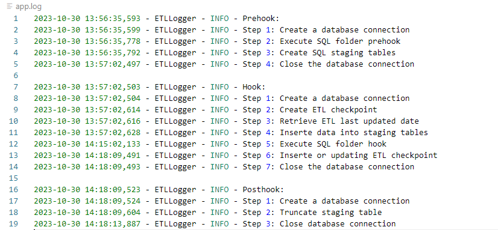 |


### Data Flow Diagrams

| Schema Diagram |
| ---------------|
|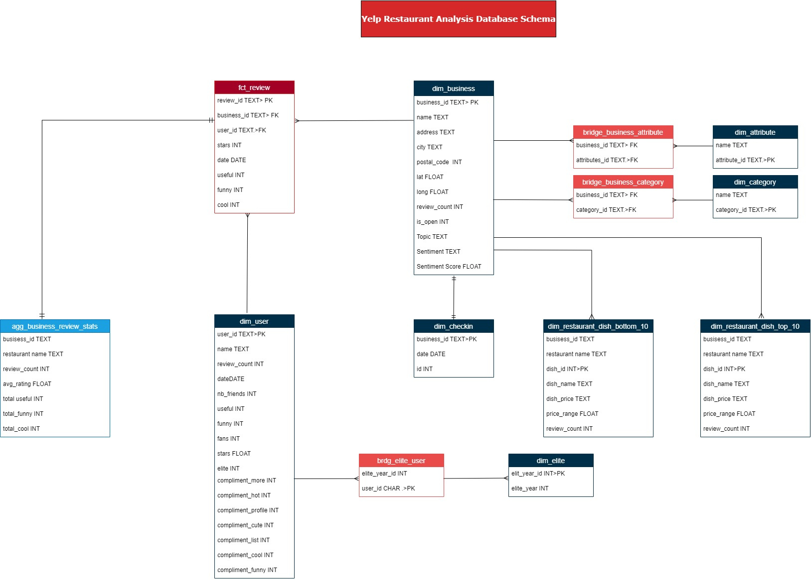 |
 

  
<br><br>


<br>
<!-- Tech stacks -->

<a  name="stacks"></a>


<br>
Yelp Restaurant Analysis is built using the following technologies:
  
## Frontend

Interactive PowerBI Dashboard: A central dashboard where viewers can view:

1. Restaurant Insights: Visualizations including graphs, charts, and data representations showcasing key restaurant attributes and trends over time.
2. Review Sentiment Analysis: I conducted sentiment analysis to understand public sentiment about the restaurants, presenting the results through pie charts and sentiment bars. 
3. Comprehensive Analysis of Yelp Restaurants: Unveiling Common Attributes,Categories, buseist hour and day.
4. Interactive filters: options to filter by region.
  

## Backend

1. Extract yelp data.
2. ETL Pipeline: using python and pandas, raw data is extracted, transformed into a usable format and loaded into postgreSQL database.
3. Database: Schema Design - Indexing - Data Integrity - Backup & Recovery.
4. Machine Learning: Sentiment Analysis - Topic Modeling.

## Machine Learning (ML) component
In my Yelp restaurant analysis project, I collected and preprocessed Yelp restaurant reviews. For topic modeling, I used Latent Dirichlet Allocation (LDA) without training a custom model. Sentiment analysis was done using the VADER tool from NLTK without model training.
I evaluated these pre-trained models based on their performance in uncovering topics and assessing sentiment in the reviews. 
<br><br>
Tools:
- **SQL:** Used to create schema tables.
- **Python:** Used to code data extraction and cleaning processes and ETL steps (Prehook, Hook, Posthook) using Python modules and libraries like pandas, requests, numpy, psycopg2, enum, etc.
- **VaderSentiment:** is a Python library for sentiment analysis of text data, ideal for analyzing reviews in your project, providing sentiment categorization and intensity scores.
- **PowerBI:** Used to create an interactive report through visuals and DAX.
    
<br>


  

<!-- Implementation -->

<a  name="Demo"  ></a>

<br>


### Report Screenshots

| Home Page |
| ----------|
|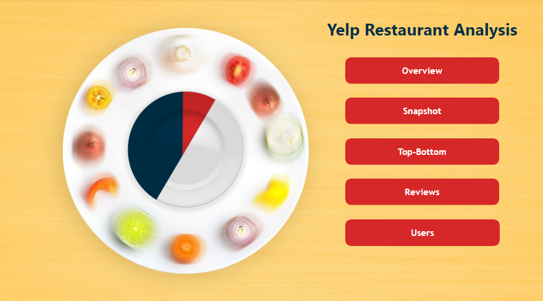 |
 

<br>

| Overview |
| ----------|
|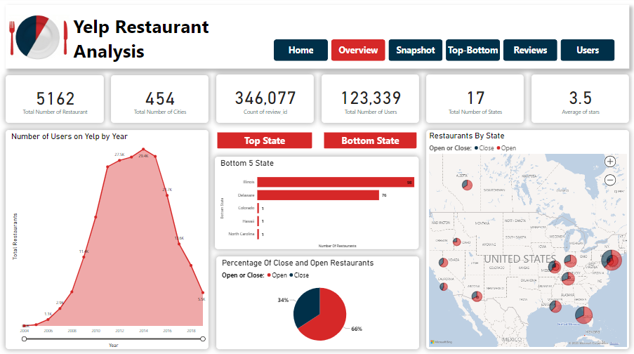 | 


 <br> 
  
| Restaurants Overview - Snapshot |
| ----------|
|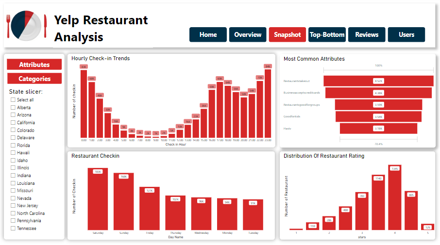 | 


  
<br>

| Top Restaurant Analysis|
| ------------------------|
|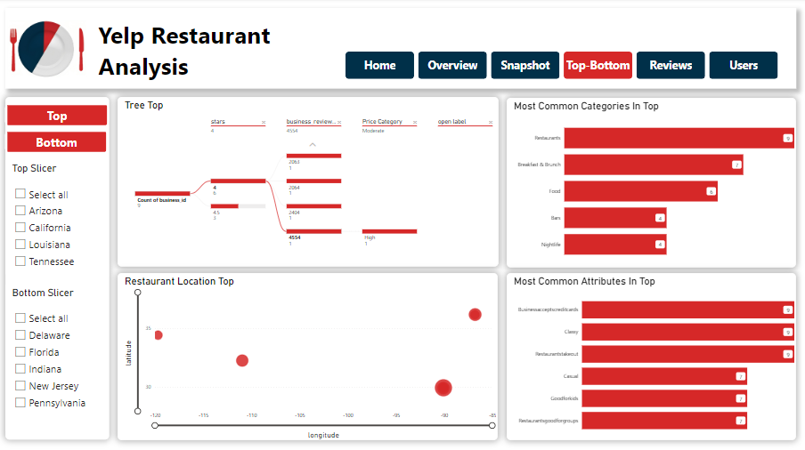 | 


<br> 
  

| Bottom Restaurant Analysis |
| -----------------|
| | 


<br> 
  
| Reviews Analysis |
| -----------------------|
|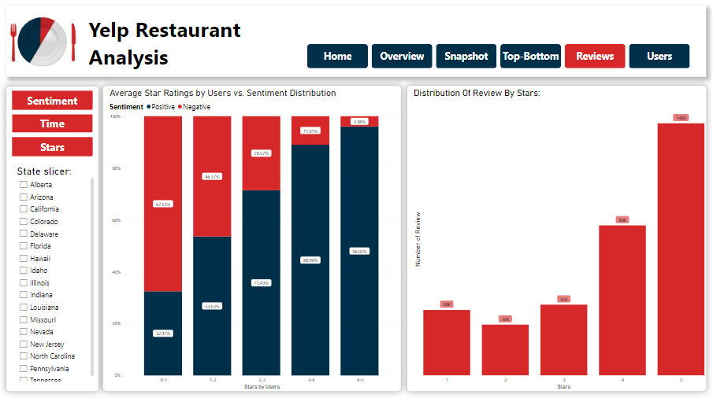 | 


<br>


| Users Analysis |
| -----------------------|
|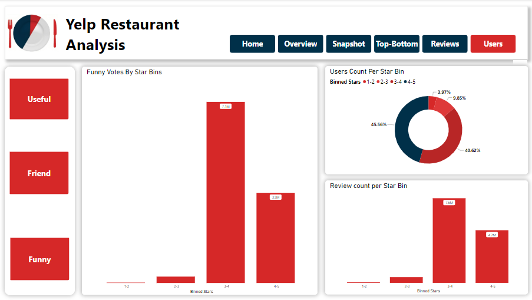 | 

<br>
  
| Home Page | Overview Page | 
| ---------| ---------| 
|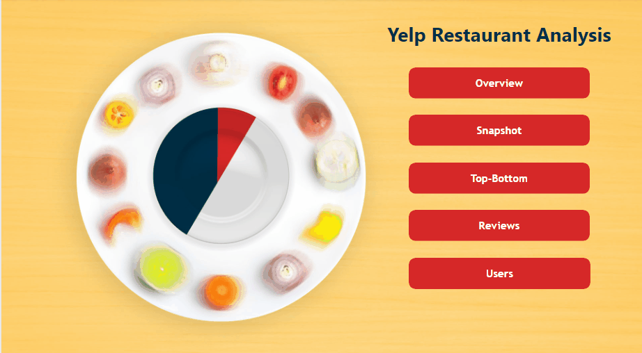 |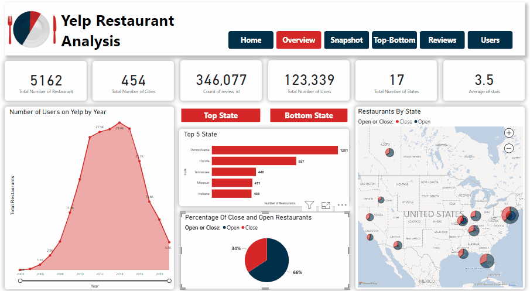|

<br>

| Snapshot Page | Top-Bottom Restaurant Page | 
| ---------| ---------| 
|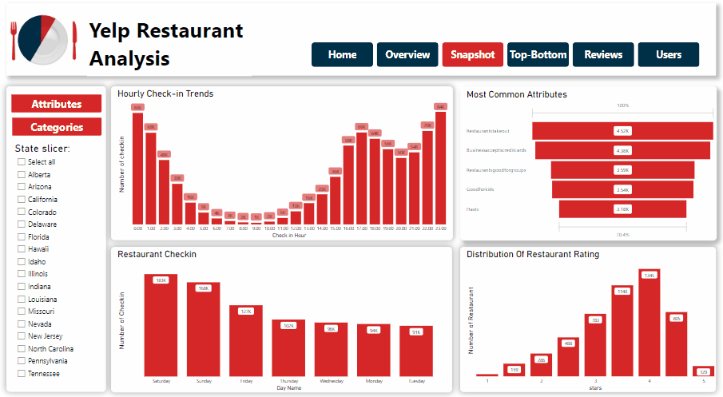 ||

<br>

| Review Page | Users Page | 
| ---------| ---------| 
|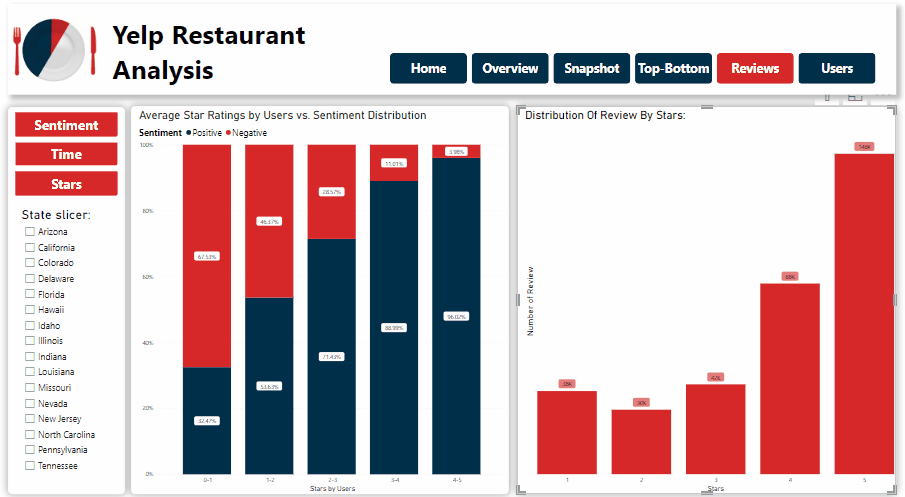 ||

<br>

| Report Recap Video|
| ---------------|


https://github.com/Rihab-Atwi/Yelp_Restaurant_Analysis/assets/76687940/b8ad365a-7319-4d8b-a8f3-22dab59586ad

<br><br>

<!-- How to run -->

<a  name="run"  ></a>

  

> To set up **Yelp Restaurant Analysis** follow these steps:

### Prerequisites


**Hardware & Software**:

-   A computer/server with sufficient RAM and processing power.
-   Operating system: Linux (preferred for production) or Windows.
-   Required software: Python (3.x), PostgreSQL, Git (for version control), and essential software packages including vaderSentiment, nltk, scikit-learn, and langdetect to collect, preprocess, and analyze Yelp reviews for sentiment, topics, and language,
  
  

**Dependencies**:

-   Install the necessary Python libraries: `pandas`, `psycopg2-binary`, `scikit-learn`, `vaderSentiment` `nltk`, and `langdetect`.
-   Install database connectors/drivers for PostgreSQL.
  

### **Setting Up the Environment**:

**Clone the Repository**:


```sh

git clone https://github.com/Rihab-Atwi/Yelp_Restaurant_Analysis.git
```

  
**Set Up the Database**:

-   Start the PostgreSQL server.
-   Create a new database and user with the appropriate permissions.
-   Run any initialization scripts to set up tables or initial.

### **Running the Backend**:

**Start the Data Ingestion & ETL Process**:
`main.py`


You should be able to check the app.log file to see the ETL work.

As for the dashboard access: Please use [this link](https://app.powerbi.com/view?r=eyJrIjoiNzg5OTZjNWUtNGY1OS00MTFjLTliZjEtM2Q4OWFmYzk0ZTQwIiwidCI6IjJhZDk2OTM0LTQzZTUtNDFjMi05NzYxLWYzMzVmZTIxNGNjMyIsImMiOjl9) to access the Power BI report.
